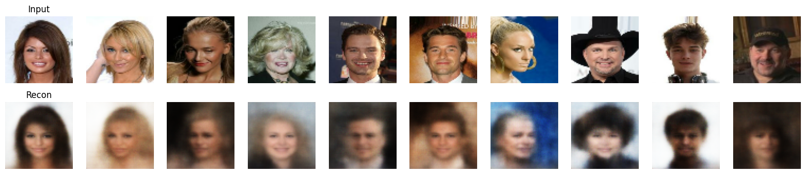
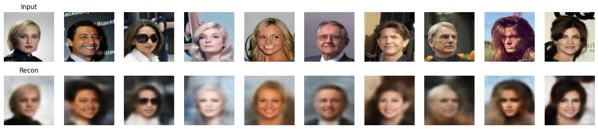
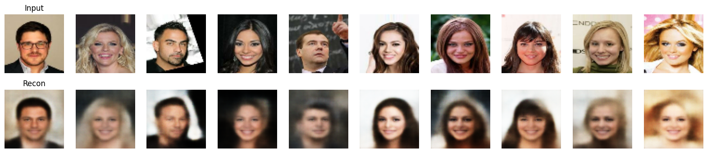

# Exploring VAE Latent Dimensions on CelebA

## Overview
The main purpose of this project is to investigate the regeneration of facial images using a Variational Autoencoder (VAE) and to analyze how the dimensionality of the latent space ($d$) affects the quality, demographic representation, and fine details of the generated results. The models were trained on the [CelebA dataset](https://www.kaggle.com/datasets/jessicali9530/celeba-dataset).

## What is a VAE?
A Variational Autoencoder (VAE) is a generative model that learns to compress data into a lower-dimensional **latent space** and then reconstruct it. Unlike standard autoencoders that map inputs to deterministic points, VAEs map inputs to a continuous probability distribution (typically a Gaussian). 

This is achieved by optimizing a combined loss function known as the Evidence Lower Bound (ELBO):

$$\mathcal{L} = \text{Reconstruction Loss} + \text{KL Divergence}$$
$$\mathcal{L} = - \mathbb{E}_{q(z|x)}[\log p(x|z)] + D_{KL}(q(z|x) \| p(z))$$

1.  **Reconstruction Loss:** Ensures the generated image closely matches the original input.
2.  **Kullback-Leibler (KL) Divergence:** Regularizes the latent space, forcing the encoded distributions to approximate a standard normal distribution $\mathcal{N}(0, I)$. 

As a direct result of this regularized loss, the learned latent space is both:
* **Continuous:** Close points in the latent space decode into highly similar images, allowing for smooth visual transitions.
* **Complete:** Sampling from any arbitrary point within the prior distribution yields a valid, recognizable image.

Because the latent space possesses these two properties, the decoder can reliably sample from it to generate entirely new, unseen facial images.
## Model Analysis
We trained and evaluated three models with varying latent space dimensions ($d$).

### 1. Small Model ($d=32$)
This model is the weakest. The restricted capacity of the latent space prevents it from capturing complex variations. In the results, we observe that the model performs poorly on certain pictures; for instance, it misunderstands facial shadows as darker skin tones. Furthermore, due to the limited representational power and the inherent imbalance in the CelebA dataset (which contains more women), the model suffers from mode collapse, regenerating a disproportionate number of faces as females.

  
  
<b>Figure 1:</b> Input vs. Reconstruction for the Small Model (d=32). Note the loss of shadows and gender bias.

### 2. Base Model ($d=64$)
This model performs noticeably better than the small one. The increased capacity allows it to accurately interpret and reconstruct lighting and shadows on the face rather than confusing them for skin tone. However, the model is still heavily biased toward generating female faces, indicating that a dimension of 64 is insufficient to fully disentangle the dataset's demographic features.

  
  
<b>Figure 2:</b> Input vs. Reconstruction for the Base Model (d=64). Lighting is improved, but gender bias persists.

### 3. Large Model ($d=128$)
This model yields the best overall reconstructions. The expanded capacity allows it to overcome the gender bias seen in the smaller models. Despite this improvement, it remains weak at regenerating high-frequency details, such as the sharp textures of hair. This is a known limitation of standard VAE architectures, as the bottleneck inherently blurs fine spatial details.

  
  
<b>Figure 3:</b> Input vs. Reconstruction for the Large Model (d=128). Best overall results, though high-frequency details remain blurred.

## Network Architecture
The baseline architecture (shown here for $d=64$) utilizes deep convolutional layers with $4 \times 4$ kernels and strides of 2 for downsampling and upsampling. Biases are omitted in convolutional layers followed by Batch Normalization.

### Encoder
| Layer (type) | Configuration / Activation | Output Shape | 
| :--- | :--- | :--- | 
| **InputLayer** | `shape=(64, 64, 3)` | `(64, 64, 3)` | 
| **Conv2D** | 128 filters, 4x4, stride 2, no bias | `(32, 32, 128)` | 
| **BatchNormalization** + **ReLU** | Standard | `(32, 32, 128)` | 
| **Conv2D** | 256 filters, 4x4, stride 2, no bias | `(16, 16, 256)` | 
| **BatchNormalization** + **ReLU** | Standard | `(16, 16, 256)` | 
| **Conv2D** | 512 filters, 4x4, stride 2, no bias | `(8, 8, 512)` | 
| **BatchNormalization** + **ReLU** | Standard | `(8, 8, 512)` | 
| **Conv2D** | 1024 filters, 4x4, stride 2, no bias | `(4, 4, 1024)` | 
| **BatchNormalization** + **ReLU** | Standard | `(4, 4, 1024)` | 
| **Flatten** | - | `(16384)` | 
| **Dense ($\mu$)** | units=d | `(d)` | 
| **Dense ($\log\sigma^2$)**| units=d | `(d)` | 

### Decoder
| Layer (type) | Configuration / Activation | Output Shape | 
| :--- | :--- | :--- | 
| **InputLayer** | `shape=(d,)` | `(d)` | 
| **Dense** | units=16384 | `(16384)` | 
| **Reshape** | `target_shape=(4, 4, 1024)` | `(4, 4, 1024)` | 
| **Conv2DTranspose**| 512 filters, 4x4, stride 2, no bias | `(8, 8, 512)` | 
| **BatchNormalization** + **LeakyReLU** | `alpha=0.2` | `(8, 8, 512)` | 
| **Conv2DTranspose**| 256 filters, 4x4, stride 2, no bias | `(16, 16, 256)` | 
| **BatchNormalization** + **LeakyReLU** | `alpha=0.2` | `(16, 16, 256)` | 
| **Conv2DTranspose**| 128 filters, 4x4, stride 2, no bias | `(32, 32, 128)` | 
| **BatchNormalization** + **LeakyReLU** | `alpha=0.2` | `(32, 32, 128)` | 
| **Conv2DTranspose**| 3 filters, 4x4, stride 2, use bias | `(64, 64, 3)` | 
| **Activation** | `sigmoid` | `(64, 64, 3)` | 

*(Note: For the d=32 and d=128 models, the architecture is identical except for the output units of the bottleneck Dense layers and the input units of the Decoder).*

## Future Work
For better results in future iterations, integrating a U-Net-like architecture into the VAE is recommended. A U-Net incorporates **skip connections** that bridge the downsampling (encoder) layers directly to the upsampling (decoder) layers. While a standard VAE forces all information to pass through a highly compressed bottleneck—which inherently destroys high-frequency spatial details like hair texture—skip connections would allow the decoder to receive direct spatial "hints" from the input. This fusion of local, high-resolution features from the encoder with the global, contextual features generated from the latent space would significantly sharpen the regenerated outputs.

---
**Course:** Deep Learning   
**University:** Amirkabir University of Technology    
**Semester:** Fall 2025    
**Author:** Hadi Salavati
